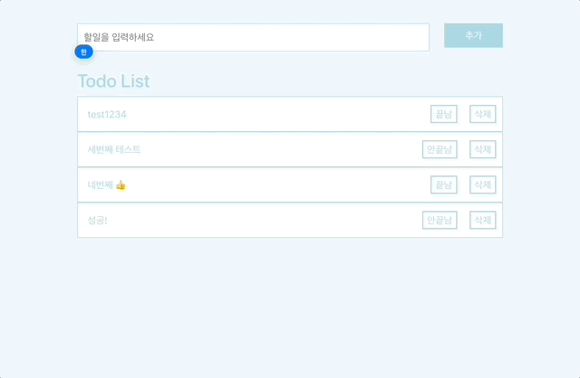
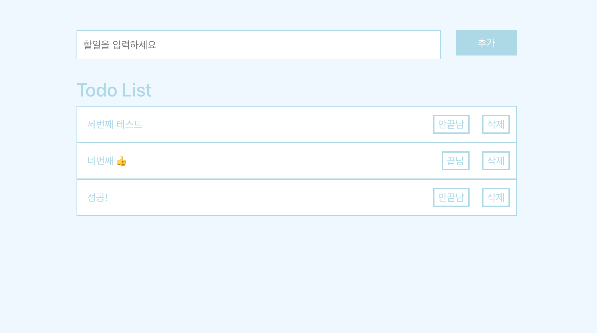
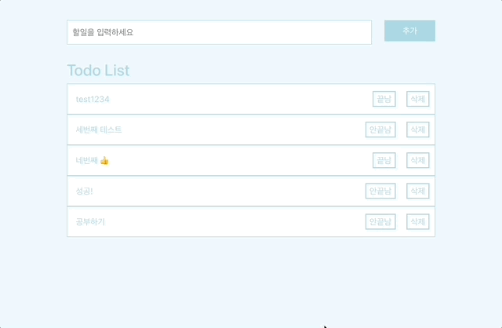
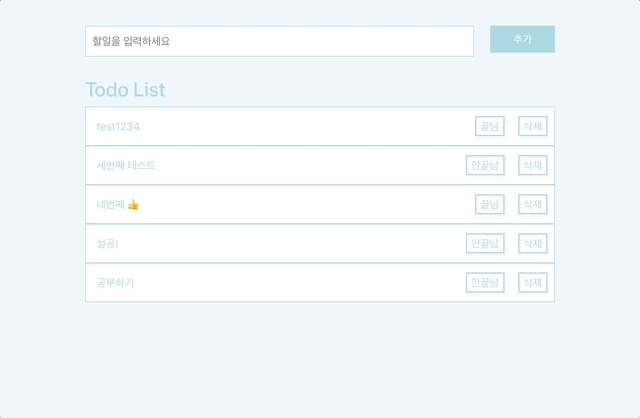

# todo-app-nodejs

## 기능

1. 할 일을 추가할 수 있다. 
   
2. 할 일 리스트를 볼 수 있다. 
   
3. 할 일에 대해 끝남,안끝남 표시를 할 수 있다. 
   
4. 할 일을 삭제할 수 있다. 
   
5. 회원가입

- 정보: 이메일, 패스워드, 이름
- 이미 가입된 유저 확인
- 패스워드 암호화 시켜 저장

6. 로그인

- 이메일과 패스워드를 입력해서 보냄
- 해당 이메일과 패스워드를 가진 유저가 있는지 확인
  - 없으면 로그인 실패
  - 있다면 유저정보 + 토큰

7. 유저 권한 확인 (todo page 로그인한 유저만 들어갈 수 있다.)
8. 로그인한 유저라면 todo page로 이동

## 백엔드

1. 기본 세팅: npm, express, mongoose, app listener

- npm install express mongoose body-parser cors dotenv bcryptjs jsonwebtoken

2. 라우터 주소 정의: restful API(주소 + http명령어)

- 추가: /tasks post
- 목록: /tasks get
- 수정: /tasks/:id put
- 삭제: /tasks/:id delete

3. 데이터베이스 스키마 정의

- Task
  | task | isComplete|
  |--|--|
  |string|boolean|

- User
  |name|email|password|
  |--|--|--|
  |string|string|string|

4. 기능 정의: CRUD
5. 테스트: postman

## 프론트엔드

1. UI: git clone
2. 기능 만들기: CRUD
3. 테스트

## 배포

1. 데이터베이스: Mongodb Altas
2. 백엔드: AWS Elastic Beanstalk
3. 프론트엔드: Netlify
